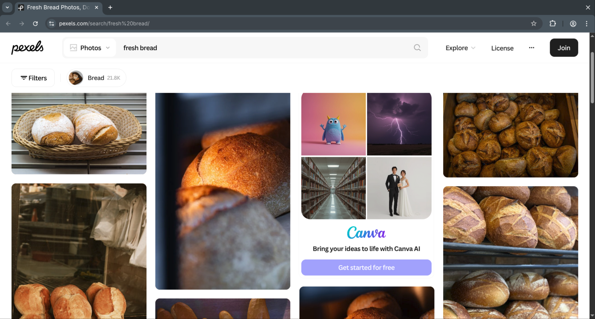
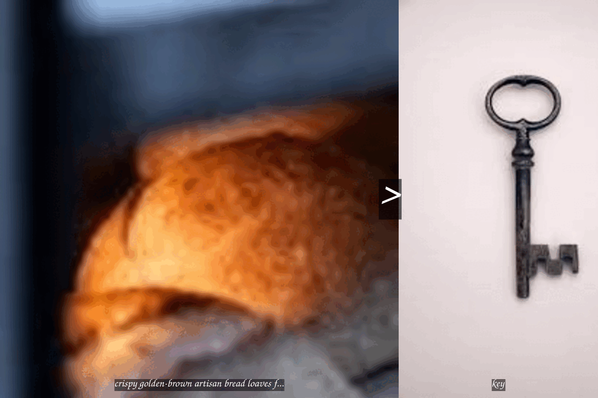

```{r setup, include=FALSE}
knitr::opts_chunk$set(echo=TRUE, message=FALSE, warning=FALSE, error=FALSE)
library(tidyverse)
selected_photos <- read_csv("selected_photos.csv")
```

```{css, echo=FALSE}
:root {
  --bg: #eef3ef;
  --ink: #1f2421;
  --muted: #4d5a52;
  --accent: #b2452e;
  --accent-2: #2d6a4f;
  --card: #f8fbf8;
  --border: #21322b;
}

* {
  box-sizing: border-box;
}

body {
  font-family: 'JetBrains Mono Nerd Font Mono', monospace;
  background:
    radial-gradient(circle at 15% 7%, #dfeee4 0%, transparent 36%),
    radial-gradient(circle at 85% 2%, #d7e8de 0%, transparent 30%),
    var(--bg);
  color: var(--ink);
  line-height: 1.6;
  font-size: 11.5pt;
  max-width: 920px;
  margin: 0 auto;
  padding: 1.2rem 2.2rem 2.8rem;
}

p {
  margin-top: 1.5em;
  margin-bottom: 1.5em;
  text-align: justify;
  color: var(--muted);
}

h1,
h2,
h3 {
  font-family: 'JetBrains Mono Nerd Font Mono', monospace;
  color: var(--ink);
}

h2 {
  width: fit-content;
  margin: 0 auto 1rem;
  text-align: center;
  text-decoration: none;
  font-size: 2rem;
  border-bottom: 4px solid var(--accent);
  padding-bottom: 0.2rem;
}

h3 {
  font-size: 1.2rem;
  text-decoration: none;
  margin-top: 2rem;
  margin-bottom: 0.8rem;
  padding-left: 0.7rem;
  border-left: 6px solid var(--accent-2);
  background: linear-gradient(to right, #eef8f8, transparent);
}

h2::after,
h3::after {
  content: "";
  display: block;
  width: 72px;
  height: 4px;
  margin-top: 0.5rem;
  border-radius: 999px;
  background: var(--accent);
}

pre {
  background-color: var(--card);
  padding: 10px;
  border: 3px solid var(--border);
  border-radius: 12px;
  box-shadow: 6px 6px 0 rgba(0, 0, 0, 0.12);
}

.figure,
.plotly,
figure {
  margin: 1.2rem auto;
  text-align: center;
}

img {
  display: block;
  margin-left: auto;
  margin-right: auto;
  border: 3px solid var(--border);
  border-radius: 12px;
  box-shadow: 6px 6px 0 rgba(0, 0, 0, 0.12);
  max-width: 92%;
  transition: transform 220ms ease, box-shadow 220ms ease;
}

img:hover {
  transform: translateY(-3px);
  box-shadow: 10px 10px 0 rgba(0, 0, 0, 0.16);
}
```

## Introduction

My two words that I chose to use for this project were "**fresh bread**". There was no particular reason that I chose these words, I just couldn't think of anything and decided on a commodity with a modifier word attached.

The Pexels search results for this my chosen words can be found at the URL: [https://www.pexels.com/search/fresh%20bread/](https://www.pexels.com/search/fresh%20bread/)

The screenshot below shows the first row of photos returned by Pexels for me when using the search term "**fresh bread**":



While doing the initial search on Pexels, I noted a few features. First, most images were framed in landscape. Second, tomatoes, cheese and wooden boards were very common, the least surprising of these was fairly obviously the wooden board. However the cheese and tomatoes were fairly surprising to see so commonly, the common trends to a point suggest some recurring themes regarding bread photography, some other items I noticed paired with bread were grain and herbs. Third was more regarding the data of the images, many had tens of thousands of views but mostly under 10 or 20 likes. Another interesting thing I noticed were how commonly rustic themed backgrounds were used, and how commonly the bread itself was described as 'rustic' in the descriptions.

The table below lists the URLs of the selected photos included in `selected_photos`:

```{r url-table}
selected_photos |>
  select(url) |>
  knitr::kable(col.names = "Photo URL", caption = "URLs of selected photos")
```

## Key features of my selected photos

```{r summary-values}
mean_resolution    <- selected_photos$resolution |> mean(na.rm = TRUE)
median_aspect_ratio <- selected_photos$aspect_ratio |> median(na.rm = TRUE)
n_selected         <- nrow(selected_photos)

grouped_photos <- selected_photos |>
  group_by(mentions_side) |>
  summarise(
    mean_resolution   = mean(resolution, na.rm = TRUE),
    mean_aspect_ratio = mean(aspect_ratio, na.rm = TRUE),
    count             = n()
  )

mean_res_with_side    <- grouped_photos$mean_resolution[grouped_photos$mentions_side == TRUE]
mean_res_without_side <- grouped_photos$mean_resolution[grouped_photos$mentions_side == FALSE]
n_with_side           <- grouped_photos$count[grouped_photos$mentions_side == TRUE]
```

After filtering, `r n_selected` photos were retained in `selected_photos`; all portrait-oriented images whose alt text described artisan or freshness qualities and a rustic or traditional setting.

The mean pixel resolution across all selected photos was `r format(round(mean_resolution), big.mark = ",")` pixels, indicating that the images are generally high-resolution and suitable for print-quality use.

The median aspect ratio of the selected photos was `r round(median_aspect_ratio, 3)`, which is consistent with a somewhat tall portrait frame - not quite as narrow as a phone-portrait shot though.

Of the `r n_selected` selected photos, `r n_with_side` had alt text that mentioned a side item such as cheese, tomatoes, or grapes; these photos had a mean resolution of `r format(round(mean_res_with_side), big.mark = ",")` pixels, compared to `r format(round(mean_res_without_side), big.mark = ",")` pixels for photos without a side item, this makes a suggestion that photography composed with more in depth sets tends to be photographed with higher resolutions.

## Creativity

```{r creativity-gif, fig.cap="Animated GIF: bread > key"}

```

The creative output for my animated GIF references the 'bread > key' meme that was popular around one to one and a half years ago. Each frame places a different portrait bread photo on the left at 800x800 and a static key photo at 400x800 with the greater than symbol overlaid overlaid between the two. The animation cycles through 10 bread frames at 2 a second.

The creativity largely utilizes knowledge from {magick} package and the module focusing on that. Rather than just producing an image, I chose to make a gif using `image_animate()` and `image_join()` are used to create a multi-frame gif. The size asymmetry between the two images is done using `image_resize()` and `image_crop()` then appending them together using `image_append()` this created each overall frame as 1200x800 pixels each using stack = FALSE to place them side by side. `image_annotate()` is used twice per frame to, once on the bread image to add the description onto the image as a caption and once again on the combined image to place the greater than symbol over it. The key frame is processed outside the loop and reused across all frames. 

## Learning reflection

Module 3 introduced content I hadn't considered being able to do in R, having the capability to process data through API's is a useful tool for data gathering and processing. Using {httr} to handle the request and response pipeline, and then using tools from other packages like `group_by()` and `summarise()` to calculate some summary statistics across different levels of a categorical variable rather than the whole data frame at once.

What I am more curious about is is pagination, limiting the data set to 80 photos and then further cutting that down to roughly 20 photos felt very limiting and too narrow in scope to do anything useful with the data. I am also interested in how to integrate multiple API calls into the same project.

## Appendix

```{r file='exploration.R', eval=FALSE, echo=TRUE}
```

```{r file='project3_report.Rmd', eval=FALSE, echo=TRUE}
```