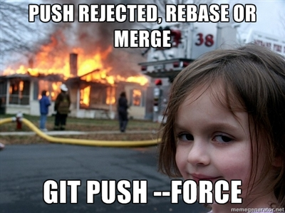
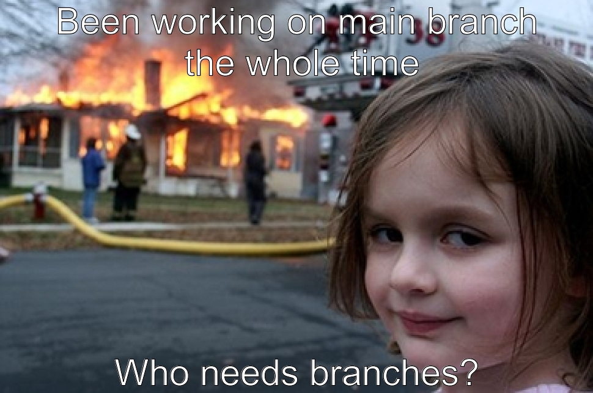

```{r setup, include=FALSE}
knitr::opts_chunk$set(echo=TRUE, message=FALSE, warning=FALSE, error=FALSE)
```

```{css}
body {
    font-family: 'JetBrains Mono Nerd Font Mono', monospace;
    background-color: #EFD2B0;
    color: #3d3d3d;
    line-height: 1.4;
    font-size: 11pt;
}

p {
    margin-bottom: 1.5em;
}

h1 {
    font-family: 'JetBrains Mono Nerd Font Mono', monospace;
    text-align: center;
    text-decoration: underline;
}

h2 {
    font-family: 'JetBrains Mono Nerd Font Mono', monospace;
    font-size: 16pt;
    text-decoration: underline;
}

pre {
    background-color: #edd9c2;
    padding: 10px;
    border: 4px solid#1f1e1e;
    border-radius: 10px;
}

img {
    border: 4px solid #1f1e1e;
    border-radius: 10px;
} 
```

## Project requirements

<!-- I like to have very visual seperators in md so will have this between each section -->

## Inspo meme

I think the two main elements of this are definitely the expression on the girls face, and the background. I think that the expression on the girls face (regardless of what actually happened in the real image) portrays a sense of smugness, kind of as though she is in part responsible for the chaos in the background.

<!-- ################################################################################## -->

## My meme

For my static meme pretty much all I changed was the joke displayed on it. I simply changed the text on it to be a different joke, but I still wanted it to be within the same genre of joke. I put most of my effort into trying to be a technical and more creative on the gif rather than the meme since thats what I was more interested in.

<!-- ################################################################################## -->

## My animated meme 


<!-- ################################################################################## -->

## Creativity

I think that my project displays creativity through its multi-part animation sequence involving multiple differing possible styles of animation. Rather than looping a static image with minor changes each time, I chose to make an annimation sequence that involved a static hold at the start and end, text fades ins, gradual tint contol and an image that rises a little and is composited onto the base. I did these by controlling values distributed across ranges and passed to `lapply()`.

Additionally, I believe that as a part of my gradual control approach I had to come up with ideas on how to control this as much of my code to my knowledge doesn't have built in functionality for the type of control I was going for, I knew I would likely have to control opacity as I have done that trick before elsewhere but the implementation took some time and thinking to get right.

During the creation of the gif, I sourced and composited two images over the original, using the `Screen` operator to blend them together. I also utilized a dynamic approach to controlling the dimensions of the fire overlay such that it responds to the base image dimensions, meaning that it will adjust it's width to match the base layer.

The fade in effect that was done by controlling opacity required generating hex alpha values using `sprintf()` and appending them it to colour strings. I think that this was a particularly creative approach.

<!-- ################################################################################## -->

## Learning reflection
<!--  
I think the learning for this project was kind of situational, I doubt I could apply most of what I learned to another project without thinking about it for some time first, I'm happy with what I've made here but I don't feel like the learning has been reinforced yet.

So far my eyes have been opened a little into how reproducible some of this stuff is, I don't think I ever really considered html as something that was this easy to create, style and embed text and images into, I had never really considered that something like R markdown would have this kind of capabilities.
-->

I think that my learning in this project was more broad across a few areas than deep. However, I do think that it served an important purpose for exposure into many of the functions and abilities of both R and the `{magick}` package/

Probably what I've found most interesting right now is definitely the pipeline in R markdown. I like how I can create HTML with it that uses css for some styling, something I would've liked would be some experience using an external css document and linking that in here instead but I understand the idea of streamlining the project idea to simplify it.

Something I enjoyed was learning the specific technical implementations of how to kind of loop to create a set of images that differed opacity or position (when using the image_composite() function).

In the future I would like to do more with CSS as I find that interesting and particularly satisfying.

To descirbe one idea from module one I would probably just settle on `{magick}`. The process of programatically editing images was something that I was unfamiliar with and hadn't really even considered it as much of a viable or effective option. However, understanding that doing it this way leads to better reproducability and that this whole this could essentially recreate itself by changing strings `upperText` and `lowerText` or the ability to even change the underlying image completely and it still being able to be built easily without redoing the entire process is pretty neat.

<!-- ################################################################################## -->

## Appendix

<mark>Do not change, edit, or remove the `R` chunk included below.</mark> 

If you are working within RStudio and within your Project1 RStudio project (check the top right-hand corner says "Project1"), then the code from the `meme.R` script will be displayed below.

This code needs to be visible for your project to be marked appropriately, as some of the criteria are based on this code being submitted.


```{r file='meme.R', eval=FALSE, echo=TRUE}

```

